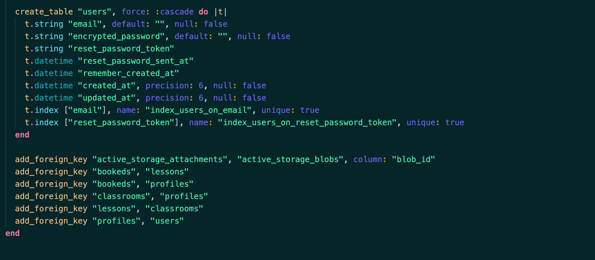

T2A2 - Two Sided Markeplace Project

## Documentation

---

[**Session it deployed app**](https://session-it.herokuapp.com/)

[**Session it github repository**](https://github.com/ArronSchick/Session_it_2)

------

This application was created as a <u>demonstration</u>. **Session it** is a two sided market place where users can list and book lessons for creative and outdoor activities. Use the links below to quickly navigate the documentation.

[toc]

____

### The Problem

**R7**. There are two sets of problems that **Session it** will solve. For Instructors/teachers offering a low barrier to entry and commitment to providing lessons full or part time as a *side business*. In a students finding the *right instructor* that can cater to their needs and help them *reach their goals* or to explore a new hobby. The following lists break the problems down further:

<u>Instructors/Teachers:</u> 

- Managing payments so there are no delays or misunderstandings.
- Managing bookings to avoid double bookings and late arrivals.
- Work/life balance.

<u>Students:</u>

- A teaching style that works well for them to learn effectively.
- Lessons that match their skill level.
- Lessons that fit in with their schedule, budget and goals.

**R8.** These problems are worth solving as their benefits to individuals have far reaching affects for the wider communitiy. Creative and outdoor pursuits benefit the mental and physical health of people and those around them. Everyone should have access to lessons like this or be able to make a living from providing them/supplement their income.

___

### The App

<u>**R11.** Purpose:</u>

To create an application that enables users to easily provide lessons for creative or outdoor activities that other users can book. Additional it is to provide users a platform to establish themselves as full time teahers/instructors or have access to quality instruction that meets their needs.

<u>Functionality / features:</u>

The application will have the following functions and features:

- Authentication, requiring an email and password, to sign up/sign in.
- User profiles which will authorise a user to access and manipulate selected content i.e Creating a classroom will give access to extra feaures and content creation which only that user can edit.
- A payment system to allow for lesson payments. **edit** this wasn't implement due to time and current skill level.
- Maps to provide directions to lesson venues. **edit** this wasn't implement due to time and current skill level.
- The ability to leave reviews on a particular teacher/instructors profile. **edit** this wasn't implement due to time.

<u>Sitemap:</u>


<u>Screenshots:</u>

<u>Target Audience:</u>

The app is designed for those who want to begin offering lessons for creative and outdoor activities as a side business with the option of commiting to it full time. It is also for those who want to book these lessons to increase their skills and get more out of an existing or new hobby.

<u>Tech stack:</u>

- html
- css
- Ruby on Rails
- Heroku
- AWS S3
- Bootstrap

___

### User Stories

<u>**R12.**Student user:</u>

- As a Student I want to be able to change my profile so I can choose how I appear online.
- As a Student I need be able to make bookings quickly and easily so I don't take much time from my day.
- As a Student I need to see all my bookings so I can easily keep track of them.
- As a Student I want to be able to find a specific instructor or lesson.
- As a Student I need to see where a lesson will be located so I know where to go.
- As a Student I need to see the times, costs and details of the lesson and instructor so I can make an informed choice.
- As a Student I want to be able to share my experience with a review to help other people choose the best lessons.

<u>Instructor/Teacher:</u>

- As an Instructor I want to see all the bookings and their details so I can keep track of them.
- As an Instructor I cannot have bookings in the same time slots or I will be double booked.
- As an Instructor I want to specifiy the times, costs and requirments of a lesson I am offering.
- As an Instructor I don't want to worry about payments so I can focus on delivering quality lessons.
- As an Instructor I want to be able to grow my client base and market myself.
- As an Instructor I want to be able to communicate with my students to help organise lessons.


___

### Wireframes

**R13.** The full set of wireframes for this project can be viewed by clicking the link below

These wireframes differ from the final designs as I found simpler ways to implement what I previosuly planned and was unable to create other pages or features due to skill limitations, technical problems and time.

[WireFrames](docs/Wireframes.pdf)

___

### ERD

**R14.**


___

### High-level components

<u>**R15.** Navbars and forms:</u>

- These are present as partials that are rendered in other views within the application. This separates html structures and functionality implemented in ruby from the rest of the program and allowys it to be reused throughout the application. This assists in authorisation with finer control over links and content based on the current user. Within forms parametres can also be passed into different controllers and be accessed by its asscociated views.

<u>Helper methods:</u> 

- Helper methods such as the devise methods `current_user` and `user_signed_in?`  allow database information to be targeted and retrieved for use in controllers and views. 

<u>Use of instance variables:</u>

- Use of instance variables abstracts away statements for querying the database and enables code to be reused in a DRY fashion. These variables can also be passed within the scope they are created or through routing to other parts of the app. **i.e** `@lesson.classroom_id = current_user.profile.classroom.id`. 

<u>Standard MVC:</u>

- Specifically the seperation of controller and views which individually handle the basic CRUD functions of the app and within that access and controll over content.

___

### Third party services

<u>**R16.** Devise:</u>

For authentiction the app will ustilse the **Devise Gem**. This provides login, registration, password resets and other security facilities to the app. It also features helper methods that can aid in database queries and control over access to application content using before actions like `before_action :authenticate_user!`. Others methods are:

```
user_signed_in? current_user user_session
```

<u>Heroku:</u>

Heroku is a cloud based service through which the app can be deployed and hosted on the internet. It can be configured for use with git and github to apply automcatic updates from the repository as commits are merged. 

<u>AWS S3:</u>

This will be used for asset storage. As users add image content to profiles, classrooms and lessons these will be stored and again accessed by the app from S3 on Amazon Web services. These assets will stored in a virtual Bucket on the S3 service.

___

### Models

**R17.** 

The project has the following models:

` user -- profile -- classroom -- lesson -- booked`

The *user model* is connected to the profile model through a `has_one :profile` relationship as a user can only have one profile. The user is needed for a profile to be created. The *profile model* then has a `belongs_to :user` to show this one to one, in addition to `has_one :classroom, dependent: :destroy` and `has_one_attached :picture`. The `has_one :classroom` here shows its relationship in a one to one with a classroom and that, if destroyed, all connected content and objects will be delted along with it. The second has one relates to the attached image input on account creation. 

The *classroom model* contains four relationships. `has_many :lessons dependent: :destroy` shows that one classroom can own many lessons and its destruction will remove other associated objects and content. ` belongs_to :profile` is its one to one with a profile. `has_one_attached :picture` and `has_one_attached :banner_image` show the images attached to a classroom.

The *lesson model* has a one classroom to many lessons with` belongs_to :classroom`. A classroom can create many lessons. Each lesson can have a booking shown by `has_one :booked, dependent: :destroy` a one to one where, again, if it is deleted any booking content will be as well. Every lesson also has an image `has_one_attached :picture`.

Finally the *booked model* has two relationships `belongs_to :profile` and `belongs_to :lesson`. Each booking is connected to a profile and lesson in a one to one relationship as only one profile can book each lesson. Once booked it isn't available to another user.

___

### Database relations

**R18.**

The databse will contain the following relations:

<u>users:</u>

Will contain columns for id:bigint, email:string and password:string. Id will identify each user and act as the foreign key in the *profiles* table as each user will own a *profile*. Email and password will be strings, with password encrypted and hidden by the devise gem.

<u>profiles:</u>

Will have the *users* foreign key and an id of its own as bigint data type. Name and bio will be seperate columns have data stored as strings. The *profile* id will be referenced in the *classrooms* table as a foreign key as each classroom will only have one *profile*.

<u>classrooms:</u>

Has its own id referenced in the *lessons* table with each *lesson* that belongs to it. It also has the foreign key of the *profile* that owns it and a column named description with data type string.

<u>lessons:</u>

Each *lesson* will contain the foreign key of the *classroom* that created and owns it. Its own id will be used as the foreign key in a booking stored in the *bookeds* table. Other columns are description and date, both stored as strings, and start_time and end_time which will have integer data types.

<u>bookeds:</u>

Lastly the *bookeds* table will only contain its own unqie id and two foreign keys, lesson_id and profile_id. These keys will show which profile(user) has booked the *lesson*, and which lesson, and therefore user through user.profile.classroom, that it belongs to.

___

### Database Schema

**R19.**




___

### Allocation and tracking of tasks

**R20.**

All tasks are tracked and allocated using a Trello board. You can access this here [Trello Board](https://trello.com/invite/b/MiACslbX/546d1000b9bd503412f1a25b8ac4b05d/t2a2-marketplace-project).

Tasks are divided up and added to sprints which have an end date. Each card has a checklist to show when tasks are 100% complete. Cards are also labeled to show what area of the project they relate to i.e documentation, programming or UI. Other relevant information is added and tracked on other boards.

___

